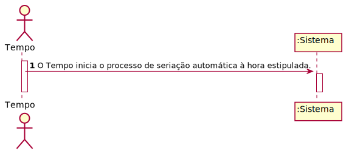
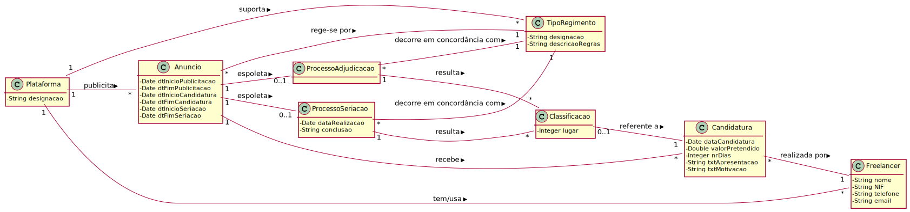
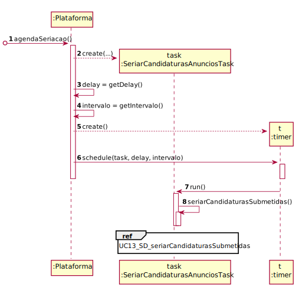
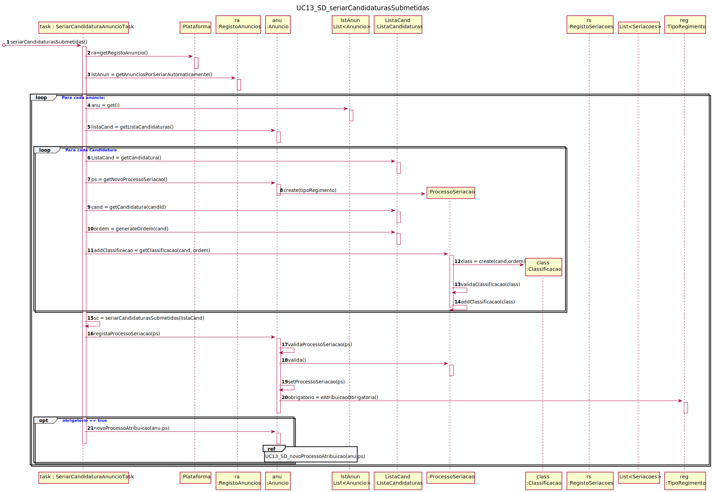
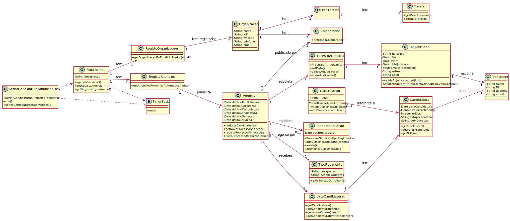

# UC 13 - Seriar (automaticamente) Candidaturas de Anúncios

## 1. Engenharia de Requisitos

### Formato Breve

O Tempo inicia o processo de seriação automática à hora estipulada, através do anuncio e recorrendo ao tipo de regimento que indica se os critérios de seriação são objetivos, estejam ainda em processo de seriação e ainda não tenham sido seriados.

### SSD

### Formato Completo

#### Ator principal

Tempo

#### Partes interessadas e seus interesses

* **Freelancer:** pretende conhecer a classificação das suas candidaturas à realização de determinados anúncios publicados na plataforma.
* **Organização:** pretende contratar pessoas externas (outsourcing) para a realização de determinadas tarefas e com competências técnicas apropriadas.
* **T4J:** pretende satisfazer as organizações e os freelancer facilitando a contratação de freelancers pelas organizações e vice-versa.

#### Pré-condições

Existir pelo menos um anúncio em condições de ser seriado automaticamente pelo Tempo.

#### Pós-condições

A informação do processo de seriação é registada no sistema.

#### Cenário de sucesso principal (ou fluxo básico)

1. O Tempo inicia o processo de seriação automática à hora estipulada.
2. O sistema efetua os processos dos anúncios que o tipo de regimento indica que os critérios de seriação são objetivos, que estejam ainda em processo de seriação e que ainda não tenham sido seriados e posteriormente inicia o processo de seriação automática.

#### Extensões (ou fluxos alternativos)

*2a. Não existe nenhum anúncio cujo tipo de regimento refere que os critérios de seriação sejam objetivos.
> O caso de uso termina.

2b. Não existe nenhum anúncio que esteja dentro do periodo de seriação.
> O caso de uso termina.

2c. Não existe nenhum anúncio que não tenha sido seriado.
> O caso de uso termina.
**

2d. A atribuição é opcional.
> O utilizador é direcionado para a UC14 (Atribuir Anúncio).O caso de uso termina. 

#### Requisitos especiais

#### Lista de Variações de Tecnologias e Dados

#### Frequência de Ocorrência

Todos os dias ao horário estipulado.

#### Questões em aberto

## 2. Análise OO

### Excerto do Modelo de Domínio Relevante para o UC

## 3. Design - Realização do Caso de Uso

### Racional

| Fluxo Principal | Questão: Que Classe... | Resposta  | Justificação  |
|:--------------  |:---------------------- |:----------|:---------------------------- |
|1. O horário de seriação automática é atingido.|...coordena a uc?     |   SeriarCandidaturasAnuncioTask      |      Task    |
|       | ...determina que o tempo foi atingido? |     Timer       |   Timer        |
|       | ...cria a instancia do timer? |   Plataforma  | creator:Plataforma conhece as horas que a seriação deve começar                
|2. O sistema identifica o anúncio cujo tipo de regimento estipula que os critérios de seriação sejam objetivos, que estejam no período de seriação e que ainda não tenham sido seriados. Posteriormente, inicia o processo de seriação automática. |  ...possui o registo de anúncios de tarefas publicadas?		|  Plataforma | IE:no MD a plataforma possui anuncios.  |
|       | ...possui o anuncio  | RegistoAnuncios | IE: RegistoAnuncios contém/agrega Anuncio (segundo Padrão HC + LC) |
|       | ...possui a lista de Candidaturas? | Anuncio | IE: no MD o anuncio tem candidaturas |
|       | ...possui a candidatura? | ListaCandidaturas | IE: Lista de Candidaturas contem candidaturas |
|       | ...cria a instancia do processo de seriação? | Anuncio | creator: no MD o anuncio espoleta o processo de seriação |
|       | ...cria, valida e adiciona a instancia da classificação? | ProcessoSeriacao | creator: no MD a classificacao é resultante do processo de seriação |
|       | ...cria a instancia do processo de Atribuicao?    |  Anuncio | creator: no MD o processo de atribuicao está associado ao anuncio |
|       | ...possui o Registo de Organizacao? | Plataforma | IE:a plataforma possui organizacao. |
|       | ...possui Organizacao? | RegistoOrganizacao | IE: RegistoOrganizacao contém/agrega Organizacao (segundo Padrão HC + LC)
|       | ...possui Freelancer? | Candidatura | IE: Freelancer efetua candidatura
|       | ...possui a tarefa? | Anuncio | IE: anuncio tem tarefa |
|       | ...cria a instancia da Adjudicacao | ProcessoAtribuicao | creator: Processo de atribuicao possui adjudicacao |

### Sistematização ##

 Do racional resulta que as classes conceptuais promovidas a classes de software são:

 * Plataforma
 * Anuncio
 * ProcessoSeriacao
 * Candidatura
 * Classificacao
 * TipoRegimento
 * ProcessoAdjudicacao
 * Adjudicacao

Outras classes de software (i.e. Pure Fabrication) identificadas:

 * SeriarCandidaturasAnuncioTask
 * RegistoAnuncios
 * RegistoOrganizacao
 * ListaCandidatura
 
Outras classes de sistemas/componentes externos:
 
  * Timer

###	Diagrama de Sequência

###	Diagrama de Classes

