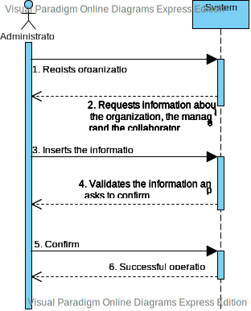
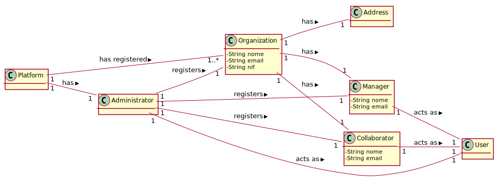

# UC1 - Register Organization

## 1- Requirements engineering

The administrator begins the registration of an organization. The system requests information about the organization (e.g. name, email, nif, address), the manager(e.g. name, email) and the collaborator(e.g. name, email, phone number). The administrator inserts the information. The system validates the information and shows it to the administrator to confirm. The system registers the information about the organization, the manager and collaborator and gives an automatic password to the manager and collaborator by email and informs the administrator about the success of the operation.

## SSD

## Full Format

### Main actor

Administrator

### Stakeholders and their interests

- Administrator: Regists the organization 
- T4J: Wants the organization to register in order to use the platform.

### Main success scenario

1. The administrator begins the registration of an organization.
2. The system requests information about the organization(e.g. name, email, nif), the manager(e.g. name, email) and the collaborator(e.g. name, email, phone number).
3. The administrator inserts the information.
4. The system validates the information and asks to confirm.
5. The administrator confirms.
6. The system regists the information about the organization, the manager and the collaborator and informs the administrator about the success of the operation.

### Extensions (alternative flow)

a.The administrator cancels the registration.
>	1.The use case ends.

2a. Missing minimum required information
>	1.The system reports the missing information.
>	2.The system allows the administator to insert the missing information.
	>2a. The administrator doesn't change the information. the use case ends.

4a. The system detects the information added already exists in the system.
>	1.The system alerts the administrator.
>	2.The system lets the user change the information
	>2a. The administrator doesn't change the information. the use case ends.

### Open questions
-Which information can detect the duplication of organizations, managers and collaborators?
-Which security rules are applied to the password?

## 2. Object oriented analysis

### Relevant Domain Model for UC

## 3.Design - Use Case realization

### Systematization

From the rational the conceptual classes promoted to software classes are:

* Platform
* Administrator
* Manager
* Collaborator

Other software classes (i.e. Pure Fabrication) identified:

* RegistOrganizationUI
* RegistOrganizationController

