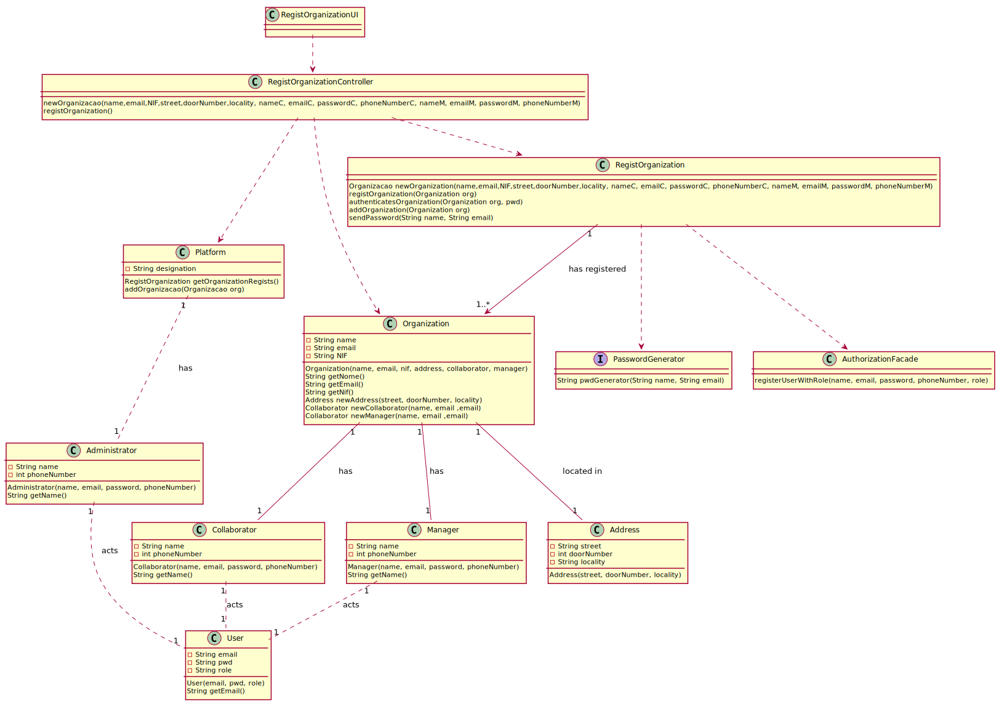

# UC1 - Register Organization

## 1- Requirements engineering

The administrator begins the registration of an organization. The system requests information about the organization (e.g. name, email, nif, address), the manager(e.g. name, email, phone number) and the collaborator(e.g. name, email, phone number). The administrator inserts the information. The system validates the information and shows it to the administrator to confirm. The administrator confirms. The system registers the information about the organization, and informs the administrator about the success of the operation. The system gives an automatic and secure password to the Collaborator and the Manager.

### SSD

## Full Format

#### Main actor

Administrator

#### Stakeholders and their interests

**Administrator:** Regists the organization 
- **T4J:** Wants the organization to register in order to use the platform.

#### Preconditions

* The administrator must exist.

#### Postconditions

* The organization is created.

#### Main success scenario (or basic flow)

1. The administrator begins the registration of an organization.
2. The system requests information about the organization(e.g. name, email, nif), the manager(e.g. name, email) and the collaborator(e.g. name, email, phone number).
3. The administrator inserts the information.
4. The system authenticates the information and asks to confirm.
5. The administrator confirms.
6. The system regists the information about the organization, the manager and the collaborator and informs the administrator about the success of the operation.

#### Extensions (alternative flow)

a.The administrator cancels the registration.
>	1. The use case ends.

2a. Missing minimum required information
>	1. The system reports the missing information.
>	2. The system allows the administator to insert the missing information.
	>2a. The administrator doesn't change the information. the use case ends.

4a. The system detects the information added already exists in the system.
>	1. The system alerts the administrator.
>	2. The system lets the user change the information
	>2a. The administrator doesn't change the information. the use case ends.

#### Special requirements

The Manager and the Collaborator passwords are generated by an external algorithm

--------------------

#### List of Technologies and Data Variations

N/A

--------------------

#### Frequency of Occurrence

N/A

--------------------

#### Open questions

* Which information can detect the duplication of organizations, managers and collaborators?
* Which security rules are applied to the password?

## 2. Object oriented analysis

### Relevant Domain Model for UC

## 3.Design - Use Case realization

| Basic flow| Question: What class.. | Answer  | Justification  |
|:--------------  |:---------------------- |:----------|:---------------------------- |
|1. The collaborator begins the registration process of an organization. |... interacts with the user? | RegistOrganizacionUI | Pure fabrication |
| |... Coordinates the UC? | RegistOrganizationController | Controller |
| |... creates instances of organizations? | Platform | Creator(rule 1) |
|2. The system requests information about the organization (e.g. name, email, nif, address), the manager(e.g. name, email) and the collaborator(e.g. name, email, phone number) |
|3. The administrator inserts the information | Stores the information inserted? | Organization, Address, Collaborator, Manager | IE: instance created in step 1 |
| | Creates instances of Addresses? | Organization | creator(rule 1) |
| | Creates instances of Collaborator? | Organization | creator(rule 1) |
| | Creates instances of  Manager? | Organization | creator(rule 1) |
|4.  The system authenticates the information and shows it to the administrator to confirm | ... authenticates the information of the Organization? (local validation) | Organization | IE: Has their own information |
| | ...authenticates the information of the Organization? (local validation) | Collaborator | IE: Has their own information |
| | ...authenticates the information of the Organization? (local validation) | Manager | IE: Has their own information |
| | ...authenticates the information of the Organization? (global validation) | Platform | IE: Platform has Organizations registered |
|5. The administrator confirms |
|6. The system **registers the information about the Organization, the Manager and Collaborator** and informs the administrator about the success of the operation | ...stores the created organization? | IE: In MD the platform has an organization
| |... regists/stores the user associated with the Manager and Collaborator | AuthorizationFacade | IE: User management is the responsibility of the respective external component whose point of interaction is through the "Facade Authorization" class | 
|7. The system gives an automatic password to the Manager and Collaborator | PasswordGenerator | IE: In MD the platform uses PasswordGenerator
| | ...sends, by email, the login information to the Manager and Collaborator? | RegistrationManager and RegistrationCollaborator | IE: Has the information to do it |

### Systematization

From the rational the conceptual classes promoted to software classes are:

* Platform
* Administrator
* Manager
* Collaborator
* PasswordGenerator

Other software classes (i.e. Pure Fabrication) identified:

* RegistOrganizationUI
* RegistOrganizationController
* AuthorizationFacade
* RegistOrganization

### Sequence Diagram

### Class Diagram

