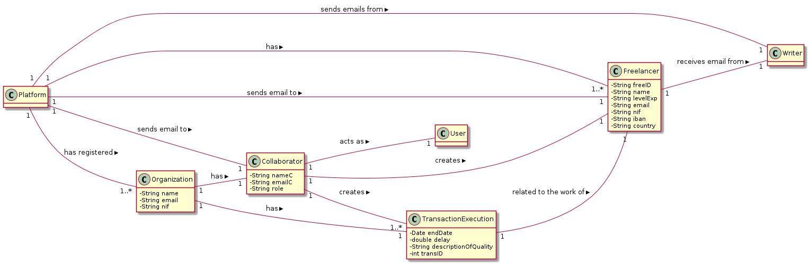
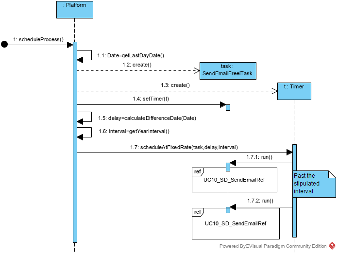
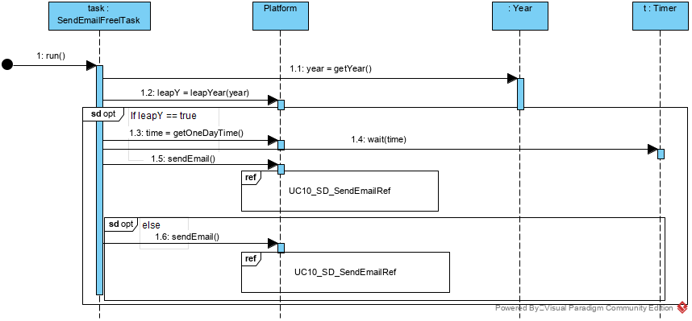

# UC 10 - Send emails about Freelancers performance

## 1. Requirements Engineering

### Brief Format

The timer starts the process of sending emails on the last day of the year according to the task delay and the percentage of the freelancers tasks delay.

### SSD

### Full format

#### Main actor

Timer

#### Stakeholders and their interests

* **Freelancer:** want to receive an email with your performance.

* **T4J:** intends for the platform to send performance reports to freelancers.

#### Preconditions

Exist freelancers to send emails.

#### Postconditions

The emails with the performance of the freelancers are sent to the respective

#### Main success scenario (or basic flow)

1. The timer iniciates the process of send emails on last day of the year .
2. The system identify the freelancers who have a task delay greater than 3 hours and their percentage of task delay higher than the percentage of overall delays. Then sends emails to them.
 
#### Extensions (or alternative flows)

2a. The process is not taking place on the last day of the year.
> the use case ends.

2b. The system does not contain freelancers.
> the use case ends.

2c. The system does not contain freelancers with a task delay greater than 3 hours or greater than the percentage of overall delays.
> the use case ends
 
 
#### Special requirements

####  List of Technologies and Data Variations

#### Frequency of Occurrence

All the last days of the years.

#### Open questions

## 2. OO Analysis

### Excerpt from the Relevant Domain Model for UC

## 3. Design - Use Case Realization

### Rational

| Main Flow  | Question: What Class...  | Answer  | Justification  |
|:--------------  |:---------------------- |:----------|:---------------------------- |
|1. The last day of year is reached.|...coordinate the uc?    |   SendEmailFreelTask      |    Controller   |
|       | ...determines that time has been reached? |     Timer       |   Timer        |
|       | ...creates the timer instance? |   Platform  | Creator+IE: The platform knows the date to start the process                
|2. The system identify the freelancers who have a task delay greater than 3 hours and their percentage of task delay higher than the percentage of overall delays. Then sends emails to them. |  ...own the freelancers?	|  RegisterFreelancer | IE+(HC+LC):Register Freelancer contains / aggregates Freelancers (according to the HC + LC standard, on Platform)|
|       | ...knows RegisterFreelancer? |     Platform      |   IE: Platform contains freelancers       |
|       | ...knows TaskExecution? |         |   IE: TaskExecution is related to the work of Freelancer      |
|       | ...knows the task delay of freelancers?|     TaskExecution       |   IE: Task Execution has the Task Delay attribute for a freelancer|
|       | ...knows the percentage task delay overall of freelancers?|     RegisterFreelancer       |   IE: RegisterFreelancer contains the overall percentage of Task delay of freelancers |
|       | ...saves the emails?|    Writer      |   IE: Writer simulates sending an email by saving|
|       | ...send the emails?|     Platform      |   IE: Platform sends the emails to the freelancers|

### Systematization ##

It follows from the rational that the conceptual classes promoted to software classes are:

 * Platform
 * RegisterFreelancer
 * Freelancer

Other software classes (i.e. Pure Fabrication) identified:  

 * SendEmailFreelTask

Other classes of external systems / components:

 * Timer

###	Sequence Diagram

###	UC10_SD_SendEmail 

###	Class Diagram

