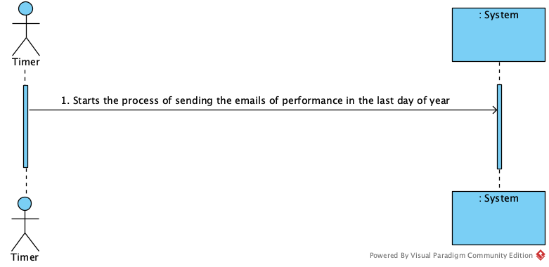

# UC 10 - Send emails about Freelancers performance

## 1. Requirements Engineering

### Brief Format

The timer starts the process of sending emails on the last day of the year according to the task delay and the percentage of the freelancers tasks delay.

### SSD

### Full format

#### Main actor

Timer

#### Stakeholders and their interests

* **Freelancer:** want to receive an email with your performance.

* **T4J:** intends for the platform to send performance reports to freelancers.

#### Preconditions

Exist freelancers to send emails.

#### Postconditions

The emails with the performance of the freelancers are sent to the respective

#### Main success scenario (or basic flow)

1. The timer iniciates the process of send emails on last day of the year .
2. The system identify the freelancers who have a task delay greater than 3 hours and their percentage of task delay higher than the percentage of overall delays. Then sends emails to them.
 
#### Extensions (or alternative flows)

2a. The process is not taking place on the last day of the year.
> the use case ends.

2b. The system does not contain freelancers.
> Redirect.
 
2a. The system does not contain freelancers with a task delay greater than 3 hours or greater than the percentage of overall delays.
> the use case ends
 
 
#### Special requirements

####  List of Technologies and Data Variations

#### Frequency of Occurrence

All the last days of the years.

#### Open questions

## 2. Análise OO

### Excerto do Modelo de Domínio Relevante para o UC

## 3. Design - Realização do Caso de Uso

### Racional

| Fluxo Principal | Questão: Que Classe... | Resposta  | Justificação  |
|:--------------  |:---------------------- |:----------|:---------------------------- |
|1. The last day of year is reached.|...coordinate the uc?    |   SendEmailFreelTask      |      Task    |
|       | ...determines that time has been reached? |     Timer       |   Timer        |
|       | ...creates the timer instance? |   Platform  | creator:                 
|2. The system identify the freelancers who have a task delay greater than 3 hours and their percentage of task delay higher than the percentage of overall delays. Then sends emails to them. |  ...own the freelancers?	|  RegisterFreelancer | IE+(HC+LC):|
|       | ...knows RegisterFreelancer? |     Platform      |   IE:       |
|       | ...knows the task delay of freelancers?|     TaskExecution       |   IE: |
|       | ...knows the percentage task delay overall of freelancers?|     RegisterFreelancer       |   IE: |
|       | ...saves the emails?|    Writer      |   IE: |
|       | ...send the emails?|     Platform      |   IE: |

### Sistematização ##

 Do racional resulta que as classes conceptuais promovidas a classes de software são:

 * Platform
 * Timer
 * RegisterFreelancer

Outras classes de software (i.e. Pure Fabrication) identificadas:

 * SendEmailFreelTask

###	Diagrama de Sequência

###	Diagrama de Classes

