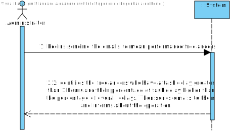
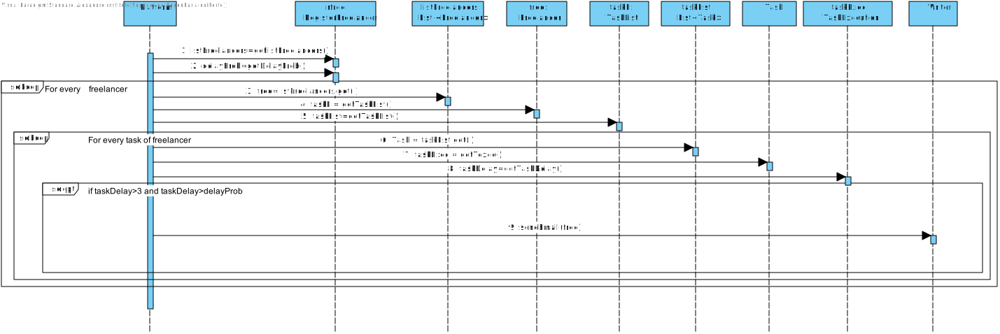

# UC 10 - Warn freelancers about their Performance

## 1. Requirements Engineering

### Brief Format

The administrator begins sending the email to mean performance freelancers. The system identifies the freelancers who have a task delay greater than 3 hours and their percentage of task delay higher than the percentage of overall delays. Then sends emails to them and informs about the operation.

### SSD

### Full format

#### Main actor

Administrator

#### Stakeholders and their interests

* **Freelancer:** want to receive an email with their performance.

* **T4J:** intends for the platform to send performance reports to freelancers.

* **Administrator: ** wants to warn the freelancers about their bad performance.

#### Preconditions

Exist freelancers to send emails.

#### Postconditions

The emails with the performance of the freelancers are sent to the respective

#### Main success scenario (or basic flow)

1. The administrator begins sending the email to mean performance freelancers.
2. The system identifies the freelancers who have a task delay greater than 3 hours and their percentage of task delay higher than the percentage of overall delays. Then sends emails to them and informs about the operation.
 
#### Extensions (or alternative flows)

2c. The system does not contain freelancers with a task delay greater than 3 hours or greater than the percentage of overall delays.
> 1. The system warns the administrator about that. The use case ends

 
#### Special requirements

\-

####  List of Technologies and Data Variations

\-

#### Frequency of Occurrence

All the last days of the years.

#### Open questions
\-

## 2. OO Analysis

### Excerpt from the Relevant Domain Model for UC

## 3. Design - Use Case Realization

### Rational

| Main Flow  | Question: What Class...  | Answer  | Justification  |
|:--------------  |:---------------------- |:----------|:---------------------------- |
|1. The administrator begins sending the email to mean performance freelancers..|...interacts with the user? | WarnAboutFreelancerPerformanceUI |Pure Fabrication|
|                                                                               |...coordinate the uc? | WarnAboutFreelancerPerformanceController | Controller|              
|2. The system identifies the freelancers who have a task delay greater than 3 hours and their percentage of task delay higher than the percentage of overall delays. Then sends emails to them and informs about the operation.|  ...contains the freelancers?	|  RegisterFreelancer | IE+(HC+LC):Register Freelancer contains / aggregates Freelancers (according to the HC + LC standard, on Platform)|
|       | ...knows RegisterFreelancer? |     Platform      |   IE: Platform contains freelancers       |
|       | ...knows TaskExecution? | Task  |   IE: TaskExecution is related to the work of Freelancer      |
|       | ...knows the task delay of freelancers?|     TaskExecution       |   IE: Task Execution has the Task Delay attribute for a freelancer|
|       | ...knows the percentage task delay overall of freelancers?|     RegisterFreelancer       |   IE: RegisterFreelancer contains the overall percentage of Task delay of freelancers |
|       | ...saves the emails?| Writer |   IE: Writer simulates sending an email by saving it|
|       | ...send the emails?| Platform |   IE: Platform sends the emails to the freelancers|
|       |...knows Writer? | Platform | IE: according to the MD, Platform has Writer |

### Systematization ##

It follows from the rational that the conceptual classes promoted to software classes are:

 * Platform
 * Freelancer
 * Task
 * Task Execution
 * Writer

Other software classes (i.e. Pure Fabrication) identified:  

 * WarnAboutFreelancerPerformanceUI
 * WarnAboutFreelancerPerformanceController
 * RegisterFreelancer

###	Sequence Diagram

###	Class Diagram

###	UC10_CD_SendEmail

