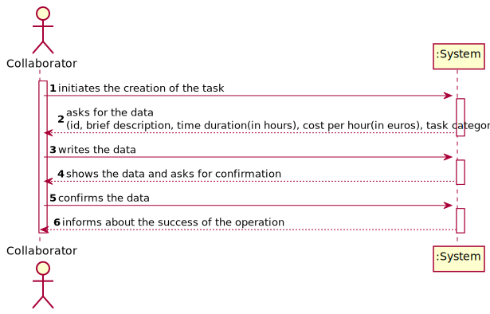
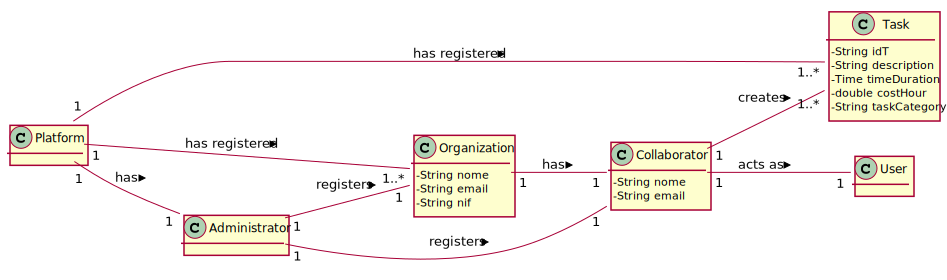

# UC 2 - Create Task

## 1. Requirements Engineering

### Brief Format

The Collaborator initiates the creation of the task. The System asks for the data (i.e. id, brief description, time duration(in hours), cost per hour(in euros), task category). The Collaborator writes the data down. The System shows the data and asks for confirmation. The Collaborator confirms. The System registers the data and informs about the success of the operation.

### SSD

### Full Format

#### Main Actor

Collaborator

#### Stakeholders and their interests

* **Collaborator:** want to create tasks.
* **Organization:** want collaborator to create tasks.
* **T4J:** intends to pay freelancers.

#### Preconditions

The Organization has to be registered in the platform.

#### Post-conditions

The tasks are available in the platform.

#### Main success scenario (or basic flow)

1. The Collaborator initiates the creation of the task.
2. The System asks for the data (id, brief description, time duration(in hours), cost per hour(in euros), task category).
3. The Collaborator writes the data down. 
4. The System shows the data and asks for confirmation.
5. The Collaborator confirms.
6. The System registers the data and informs about the success of the operation.

#### Extensions (or alternative flow)

*a. The Collaborator requests to cancel the creation of the task.

> The use case ends.

4a. Missing minimum required data.
>    1. The system informs you which data is missing.
>    2. The system allows the entry of missing data (step 3)
>
    >    2a. The Collaborator does not change the data. The use case ends.

4b. The System detects that the data (or some subset of the data) entered must be unique and that it already exists in the system.
>    1. The system alerts the collaborator to the fact.
>    2. The system allows its modification (step 3)
>
    >    2a.  The Collaborator does not change the data. The use case ends.

4c. The system detects that the data entered (or some subset of the data) is invalid.
> 1. The system alerts the collaborator to the fact.
> 2. The system allows its modification (step 3).
>
    > 2a.  The Collaborator does not change the data. The use case ends.

#### Special Requirements

#### List of Technologies and Data Variations

#### Frequency of Occurrence

#### Open questions

## 2. OO Analysis

### Excerpt from the Relevant Domain Model for UC

## 3. Design - Use Case Realization

### Rational

| Main Flow | Question: Which Class ... | Answer  | Justification  |
|:--------------  |:---------------------- |:----------|:---------------------------- |
| 1. The Collaborator initiates the creation of the task. 		 | ...interacts with the user?						 |   CreateTaskUI          |       Pure Fabrication           |
|       | ...coordinates the UC? | CreateTaskController | Controller |
|       | ...creates Task instance? | TaskList | Creator (Regra1) + HC/LC |
|       | ...session??? |   |   |
|       | ...which organization the user / collaborator belongs to? | OrganizationRegister | IE: Knows every Organization |
|       |       | Organization | IE: Knows its Collaborators |
|       |       | Collaborator | IE: Knows his own data (e.g. email) |
| Passo2  		 |							 |             |                              |
| Passo3  		 |							 |             |                              |
| Passo4  		 |							 |             |                              |
| Passo5  		 |							 |             |                              |
| Passo6  		 |							 |             |                              |

### Sistematização ##

 Do racional resulta que as classes conceptuais promovidas a classes de software são:

 * Classe1
 * Classe2
 * Classe3

Outras classes de software (i.e. Pure Fabrication) identificadas:

 * xxxxUI
 * xxxxController

###	Diagrama de Sequência

###	Diagrama de Classes

