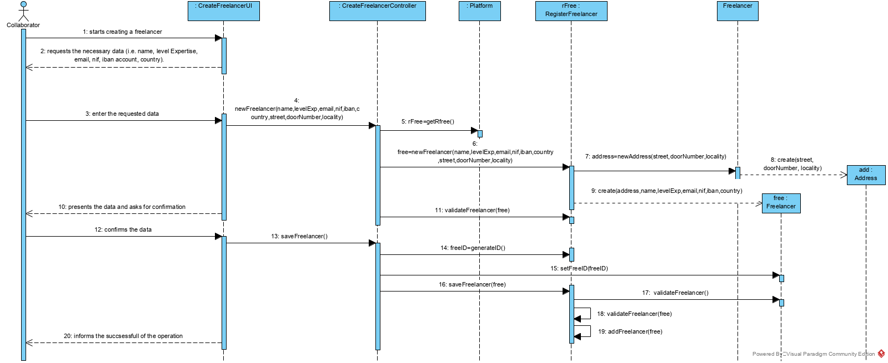
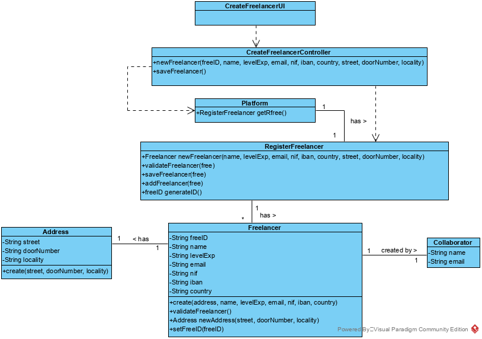

# UC 3 - Create Freelancer

## 1. Requirements Engineering

### Brief Format

The collaborator starts creating a freelancer. The system requests the necessary (i.e. name, levelExpertise, email, nif, ibanAccount, country, street, doorNumber, locality). The collaborator enter the requested data. The system presents the data and asks for confirmation. The collaborator confirms. The system informs the collaborator of the successfull of the operation.

### SSD

### Full format

#### Main actor
Collaborator

#### Stakeholders and their interests

**Collaborator:** intends to create freelancers to assign them to their tasks.

**T4J:** pretende que o freelancer em causa esteja registado no sistema de modo a utilizar a plataforma.

#### Preconditions

n/a

#### Postconditions

* The freelancer is created.

#### Main success scenario (or basic flow)

1. The collaborator starts creating a freelancer.
2. The system requests the necessary (i.e. name, levelExpertise, email, nif, ibanAccount, country, street, doorNumber, locality).
3. The collaborator enter the requested data. 
4. The system validates, presents the data and asks for confirmation.
5. The collaborator confirms the data.
6. the system generates the freelancer id, saves it and informs the collaborator of the successfull of the operation.

#### Extensions (or alternative flows)
 
1a. The collaborator requests to cancel the creation.
>    1. The use case ends.

4a. The collaborator does not enter all the requested data
>    1. The system informs you which data is missing.
>    2. The system allows the collaborator to enter the missing data (step 3).
>
	>	2a. The collaborator does not change the data. The use case ends.

11c. The system detects that the data (or some subset of the data) entered (i.e. freelancer identifier, ibanAccount) must be unique and that it already exists in the system.
>    1. The system alerts the collaborator to the fact.
>    2. The system allows the collaborator to change it (step 3)
>
	>	2a. The collaborator does not change the data. The use case ends.
     

#### Special requirements
--------------------

#### List of Technologies and Data Variations
--------------------

#### Frequency of Occurrence
--------------------

#### Open questions

* Are there any other mandatory data in addition to those already known?
* What data together can detect the duplication of freelancers?
* How often does this use case occur?
 
## 2.OO Analysis

### Excerpt from the Relevant Domain Model for UC

## 3. Design - Use Case Realization

### Rational

| Main Flow | Question: What Class... | Answer | Justification  |
|:--------------  |:---------------------- |:----------|:---------------------------- |
|1. The collaborator starts creating a freelancer |... interact with collaborator?| CreateFreelancerUI |Pure Fabrication|
| |... coordinate the UC?| CreateFreelancerController |Controller|
| |... create instances of freelancer?|RegisterFreelancer|Creator (rule1) combined with HC + LC on Platform: Platform delegates responsibilities for RegisterFreelancer|
| |... knows RegisterFreelancer?| Platform | IE: Platform contains RegisterFreelancer
|2. The system requests the necessary data (i.e. freelancer identifier, name, level Expertise, email, nif, iban account, country).|... interact with collaborator?| CreateFreelancerUI |Pure Fabrication|
|3. The collaborator enter the requested data|... save the entered data?|Freelancer|IE: Freelancer knows your attributes|
| |... create instances of Adress?| Freelancer |Creator+IE: Freelancer contains adress|
| |... save Address?| Freelancer |IE: Freelancer contains address|
|4. The system validates, presents the data and asks for confirmation |... validates freelancer data( Global Validation )|RegisterFreelancer| IE: RegisterFreelancer contains Freelancer and knows them all|
| |... validates freelancer data( local Validation )|Freelancer| IE: Freelancer knows his attributes |
| |... validates Address data( local Validation )|Address| IE: Address knows his attributes |
| |... validates Address data( global Validation )|Freelancer| IE: Freelancer contains address|
| |... generates the Freelancer ID?| RegisterFreelancer | IE: RegisterFreelancer contains freelancers and knows their codes|
| |... saves the Freelancer ID?| Freelancer | IE: Freelancer has freelancer ID has attribute |
|5. The collaborator confirms the data |||  |
|6. The system informs the collaborator of the successfull of the operation||| |

### Systematization ##

It follows from the rational that the conceptual classes promoted to software classes are:

 * RegisterFreelancer
 * Freelancer
 * Platform
 * Address

Other software classes (i.e. Pure Fabrication) identified:  

 * CreateFreelancerUI  
 * CreateFreelancerController

###	Sequence Diagram

###	Class Diagram

