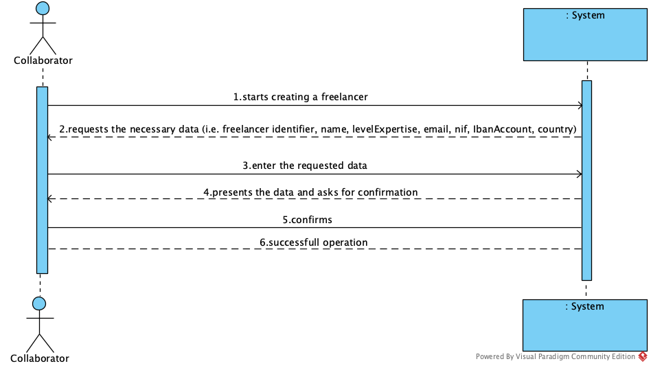
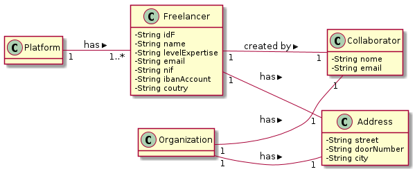

# UC 3 - Create Freelancer

## 1. Requirements Engineering

### Brief Format
The collaborator starts creating a freelancer. The system requests the necessary (i.e. freelancer identifier, name, levelExpertise, email, nif, ibanAccount, country). The collaborator enter the requested data. The system presents the data and asks for confirmation. The collaborator confirms. The system informs the collaborator of the successfull of the operation.

### SSD

### Full format

#### Main actor
Collaborator

#### Stakeholders and their interests

**Collaborator:** intends to create freelancers to assign them to their tasks.

**T4J:** pretende que o freelancer em causa esteja registado no sistema de modo a utilizar a plataforma.

#### Preconditions

n/a

#### Postconditions

* The freelancer is created.

#### Main success scenario (or basic flow)

1. The collaborator starts creating a freelancer.
2. The system requests the necessary (i.e. freelancer identifier, name, levelExpertise, email, nif, ibanAccount, country).
3. The collaborator enter the requested data. 
4. The system validates, presents the data and asks for confirmation.
5. The collaborator confirms the data.
6. The system informs the collaborator of the successfull of the operation.

#### Extensions (or alternative flows)
 
1a. The collaborator requests to cancel the creation.
>    1. The use case ends.

4a. The collaborator does not enter all the requested data
>    1. The system informs you which data is missing.
>    2. The system allows the collaborator to enter the missing data (step 3).
>
	>	2a. O administrativo não altera os dados. O caso de uso termina.

11c. The system detects that the data (or some subset of the data) entered (i.e. freelancer identifier, ibanAccount) must be unique and that it already exists in the system.
>    1. The system alerts the collaborator to the fact.
>    2. The system allows you to change it (step 3)
>
	>	2a. The collaborator does not change the data. The use case ends.
     

#### Special requirements
--------------------

#### List of Technologies and Data Variations
--------------------

#### Frequency of Occurrence
--------------------

#### Open questions

* Are there any other mandatory data in addition to those already known?
* What data together can detect the duplication of freelancers?
* How often does this use case occur?
 
## 2. Análise OO

### Excerto do Modelo de Domínio Relevante para o UC

## 3. Design - Realização do Caso de Uso

### Racional

| Fluxo Principal | Questão: Que Classe... | Resposta  | Justificação  |
|:--------------  |:---------------------- |:----------|:---------------------------- |
|1. O administrativo inicia o registo de um freelancer. |... interage com o administrativo?| RegistarFreelancerUI |Pure Fabrication|
| |... coordena o UC?| RegistarFreelancerController |Controller|
| |... cria instâncias de Freelancer?|RegistoFreelancer|Creator(regra1) combinado com HC+LC sobre Plataforma.|
|2. O sistema solicita os dados que caracterizam o freelancer (i.e., o nome, o NIF, o endereço postal, um contacto telefónico e email).||||
|3. O administrativo introduz os dados solicitados. |... guarda os dados introduzidos?|Freelancer, EnderecoPostal| IE: instância criada no passo 1|
| |... cria instâncias de EnderecoPostal?|Freelancer|creator(regra1)|
|4. O sistema solicita a introdução de uma habilitação académica (grau, designação do curso, instituição que concedeu o grau e média do curso).||||
|5. O administrativo introduz os dados solicitados. |... guarda os dados introduzidos?|Freelancer, HabilitacaoAcademica| IE: instância criada no passo 1|
| |... cria instâncias de HabilitacaoAcademica?|Freelancer|creator(regra1)|
|6. Os passos 4-5 repetem-se até que o administrativo tenha introduzido todas as habilitações académicas do freelancer.|||| 
|7. O sistema mostra a lista de competências técnicas e respetivos graus de proficiência e solicita a introdução de reconhecimento de competências técnicas atribuídas.|...conhece as CT?|RegistoCT|Plataforma tem um RegistoCT (cf. UC 4).|
| |...conhece os graus de proficiência|CT|IE.: Cada CT conhece os seus graus de proeficiência.|
|8. O administrativo introduz os dados solicitados. |... guarda os dados introduzidos?|Freelancer, ReconhecimentoCompetenciaTecnica| IE: instância criada no passo 1|
| |... cria instâncias de ReconhecimentoCompetenciaTecnica?|Freelancer|creator(regra1)|
|9. Os passos 7-8 repetem-se até que o administrativo tenha introduzido todos os reconhecimento de competências técnicas do freelancer.|||| 
|10. O sistema valida e apresenta os dados, pedindo que os confirme. |... valida os dados do Freelancer (validação local)|Freelancer|IE: possui os seus próprios dados|
| |... valida os dados das habilitações académicas (validação local)| HabilitacaoAcademica|IE: possui os seus próprios dados|
| |... valida os dados das habilitações académicas (validação global)| Freelancer |IE: Freelancer possui as suas habilitações académicas|
| |... valida os dados dos reconhecimentos de competências técnicas (validação local)|ReconhecimentoCompetenciaTecnica|IE: possui os seus próprios dados|
| |... valida os dados dos reconhecimentos de competências técnicas (validação global)| Freelancer |IE: Freelancer possui os seus reconhecimentos|
| |... valida os dados do Freelancer (validação global)|RegistoFreelancer|IE: O RegistoFreelancer tem registados Freelancer|
|11. O administrador confirma.  ||||
|12. O sistema regista os dados do freelancer,cria um utilizador para o freelancer e envia-lhe por e-mail os dados de acesso à plataforma e, por fim, informa o administrativo do sucesso da operação. |... guarda o Freelancer criado?| RegistoFreelancer |IE: No MD a Plataforma tem  Organizacao|
| |... regista/guarda o Utilizador referente ao Freelancer?|AutorizacaoFacade|IE. A gestão de utilizadores é responsabilidade do componente externo respetivo cujo ponto de interação é através da classe "AutorizacaoFacade"|
| |... gera a password do Freelancer?| AlgoritmoGeradorPasswords|	IE: no MD o AlgoritmoGeradorPasswords gera password de Utilizador.|
| | ...conhece o AlgoritmoExternoGeracaoPwd?|Plataforma|IE: no MD a Plataforma recorre a AlgoritmoGeradorPasswords.|
| |...implementa as particularidades de cada algoritmo externo em concreto?| AlgoritmoGeradorPasswords| Protected Variation + Adapter|
| |...envia, por email, os dados de acesso ao Freelancer?| RegistoFreelancer| IE: possui os dados para o fazer.|

### Sistematização ##

 Do racional resulta que as classes conceptuais promovidas a classes de software são:

 * Plataforma
 * Freelancer
 * HabilitacaoAcademica
 * ReconhecimentoCompetenciaTecnica
 * EnderecoPostal
 * CompetênciaTécnica
 * GrauProficiencia
 * AlgoritmoGeradorPasswords

Outras classes de software (i.e. Pure Fabrication) identificadas:  

 * RegistarFreelancerUI  
 * RegistarFreelancerController
 * RegistoFreelancer
 * RegistoCT
 

###	Diagrama de Sequência

**Nota:** 
Atentem na questão do endereço postal no mensagem 7 e 8:

* Na mensagem 7 é enviado como uma string e;
* ficou o Freelancer com a responsabilidade de instanciar EnderecoPostal no seu construtor (mensagem 8). 

Desta forma evita-se o método estático na classe Freelancer.

**Esta é uma alternativa mais interessante do que a adotada no UC 1.**

###	Diagrama de Classes

---

