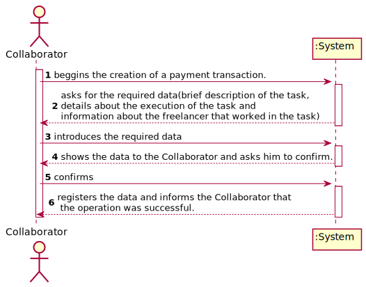

# UC 4 - Create Payment Transaction

## 1.Requirement Engineering

### Brief format
The Collaborator beggins the creation of a payment transaction. The system asks for the necessary data (brief description of the task, details about the execution of the task and information about the freelancer that worked in the task). The Collaborator introduces the required data. The system shows the data to the Collaborator and asks him to confirm. The collaborator confirms. The system registers the data and informs the Collaborator that the operation was successful.

### SSD

### Full Format

#### Main Actor

Collaborator

#### Stakeholders and their interests
**Collaborator**: wants to create a payment transcation, so that the organizations can pay to the freelancers.

**Freelancer:** wants the transaction to be created, so he can receive the payment.

**T4J:** intends that the payment transactions are created, so that the organizations can pay to the freelancers .

**Organization**: intends to pay to the freelancer for the task

#### Preconditions

n/a

#### Postconditions
* A payment transaction is created in the system

#### Main success scenario 

1. The Collaborator beggins the creation of a payment transaction.
2. The system shows the Collaborator a list of tasks and asks him to choose one.
3. The collaborator chooses one task from the list.
4. The system shows the collaborator a list of freelancers that are present in the system and asks the collaborator once again to choose of of them.
5. The collaborator chooses one freelancer from the list.
6. The System asks for the rest of the necessary data(details about the execution of the task(end date, delay, brief description of the quality of the work)).
7. The Collaborator introduces all the necessary data.
8. The system validates and shows the data to the Collaborator asking him to confirm.
9. The collaborator confirms.
10. The system regists the data and informs the Collaborator that the operation was successful.

#### Extensions

*a. The Collaborator ends the creation of a payment transaction.

> The use case ends.

2a. The list of tasks is empty
>	1. The system redirects the collaborator to UC2 (Create Task). The use case ends.

4a. The list of freelancers is empty
>	1. The system redirects the collaborator to UC3 (Create Freelancer). The use case ends.
	

6a. The system detects that the data (or some part of it) introduced is not valid.
>	1. The system informs which data is invalid.
>	2. The system allows the Collaborator to introduce the data once again (step 7). 

>
	>	2a. The collaborator doesn't change the data. The use case ends.
	

#### Special requirements
\-

#### Lista of Data and Techonology variation
\-

#### Frequency of Occurence

\-

#### Open Questions

\-

## 2. Object oriented analysis

### Excerpt from the Relevant Domain Model for UC

## 3. Design - Realização do Caso de Uso

### Racional

| Main Flux | Question: Which class... | Answer  | Justification  |
|:--------------  |:---------------------- |:----------|:---------------------------- |
|1. The Collaborator beggins the creation of a payment transaction. |... interacts with te Collaborator?| CreateTransactionUI |Pure Fabrication|
| |... coordinates the UC?| CreateTransactionController |Controller|
| |... creates instances of Transaction |RegisterTransaction|Creator(rule1) combined with HC+LC with Platform.|
| |...knows RegisterTransaction? | Platform | IE: Platform has RegisterTransaction |
|2. The system shows the Collaborator a list of tasks and asks him to choose one.|...has the list of tasks?| TaskList|HC+LC with Platform|
|  |...knows TaskList? | Organization | IE: Organization has TaskList | 
|3. The collaborator chooses one task from the list. ||||
|4. The system shows the collaborator a list of freelancers that are present in the system and asks the collaborator once again to choose of of them.|...has the list of Freelancers?| RegisterFreelancer| HC+LC|
| |...knows RegisterFreelancer?| Platform | IE: Platform has RegisterFreelancer |
|5. The collaborator chooses one freelancer from the list. |... 
|6. The System asks for the rest of the necessary data(details about the execution of the task(end date, delay, brief description of the quality of the work)).|||| 
|7. The Collaborator introduces all the necessary data.|...saves all the information introduced? | Transaction | Creator (rule1) |
|                                          |...creates an instance of TaskExecution? | Transaction | IE: in the MD, Transaction has Taskexecution |
|8. The system shows the data to the Collaborator and asks him to confirm |... validates the Transaction data (Global validation)? | RegisterTransaction | HC+LC combined with IE, because RegisterTransaction has all the Transactions|
|    |...validates the Transaction data (local validation)? | Transaction | IE: knows its own data |
|    |...validates the TaskExecution data (global validation) | Transaction | IE: in the MD, Transaction has TaskExecution |
|    |...validates the TaskExecution data (local validation) | TaskExecution | IE: knows its own data |
|9. The collaborator confirms.|||| 
|10. The system registers the data and informs the Collaborator that the operation was successful. |...saves the created instance of Transaction | RegisterTransaction| HC+LC | 

### Sistematization ##

From the racional, the conceptual classes that are promoted to software classes are:

 * Platform
 * Organization
 * Transaction
 * TaskExecution
 

Other software classes (eg: Pure Fabrication) identified:

 * CreateTransactionUI
 * CreateTransactionController
 * RegisterTransaction
 * RegisterFreelancer
 * TaskList
 
 

### Sequence Diagram

### Class Diagram

