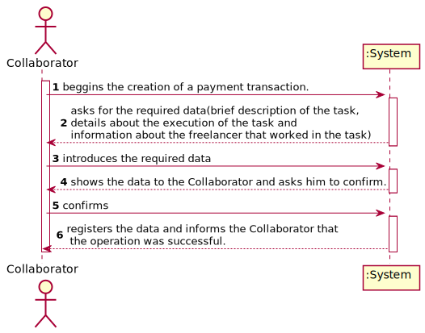
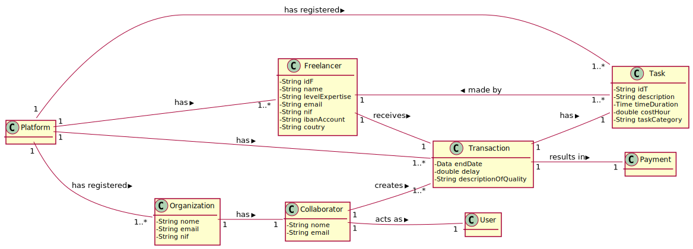

# UC 4 - Create Payment Transaction

## 1.Requirement Engineering

### Brief format
The Collaborator beggins the creation of a payment transaction. The system asks for the necessary data (brief description of the task, details about the execution of the task and information about the freelancer that worked in the task). The Collaborator introduces the required data. The system shows the data to the Collaborator and asks him to confirm. The collaborator confirms. The system registers the data and informs the Collaborator that the operation was successful.

### SSD

### Full Format

#### Main Actor

Collaborator

#### Stakeholders and their interests
**Collaborator**: wants to create a payment transcation, so that the organizations can pay to the freelancers.

**Freelancer:** wants the transaction to be created, so he can receive the payment.

**T4J:** intends that the payment transactions are created, so that the organizations can pay to the freelancers .

**Organization**: intends to pay to the freelancer for the task

#### Preconditions

n/a

#### Postconditions
* A payment transaction is created in the system

#### Main success scenario 

1. The Collaborator beggins the creation of a payment transaction.
2. The system shows the Collaborator a list of tasks and asks him to choose one.
3. The collaborator chooses one task from the list.
4. The system shows the collaborator a list of freelancers that are present in the system and asks the collaborator once again to choose of of them.
5. The collaborator chooses one freelancer from the list.
6. The System asks for the rest of the necessary data(details about the execution of the task(end date, delay, brief description of the quality of the work)).
7. The Collaborator introduces all the necessary data.
8. The system validates and shows the data to the Collaborator asking him to confirm.
9. The collaborator confirms.
10. The system regists the data and informs the Collaborator that the operation was successful.

#### Extensions

*a. The Collaborator ends the creation of a payment transaction.

> The use case ends.

2a. The list of tasks is empty
>	1. The system redirects the collaborator to UC2 (Create Task). The use case ends.

4a. The list of freelancers is empty
>	1. The system redirects the collaborator to UC3 (Create Freelancer). The use case ends.
	

6a. The system detects that the data (or some part of it) introduced is not valid.
>	1. The system informs which data is invalid.
>	2. The system allows the Collaborator to introduce the data once again (step 7). 

>
	>	2a. The collaborator doesn't change the data. The use case ends.
	

#### Special requirements
\-

#### Lista of Data and Techonology variation
\-

#### Frequency of Occurence

\-

#### Open Questions

\-

## 2. Object oriented analysis

### Excerpt from the Relevant Domain Model for UC

## 3. Design - Realização do Caso de Uso

### Racional

| Fluxo Principal | Questão: Que Classe... | Resposta  | Justificação  |
|:--------------  |:---------------------- |:----------|:---------------------------- |
|1. The Collaborator beggins the creation of a payment transaction. |... interacts with te Collaborator?| CreateTransactionUI |Pure Fabrication|
| |... coordinates the UC?| CreateTransactionController |Controller|
| |... creates instances of Transaction |RegistoFreelancer|Creator(regra1) combinado com HC+LC sobre Plataforma.|
|2. O sistema solicita os dados que caracterizam o freelancer (i.e., o nome, o NIF, o endereço postal, um contacto telefónico e email).||||
|3. O administrativo introduz os dados solicitados. |... guarda os dados introduzidos?|Freelancer, EnderecoPostal| IE: instância criada no passo 1|
| |... cria instâncias de EnderecoPostal?|Freelancer|creator(regra1)|
|4. O sistema solicita a introdução de uma habilitação académica (grau, designação do curso, instituição que concedeu o grau e média do curso).||||
|5. O administrativo introduz os dados solicitados. |... guarda os dados introduzidos?|Freelancer, HabilitacaoAcademica| IE: instância criada no passo 1|
| |... cria instâncias de HabilitacaoAcademica?|Freelancer|creator(regra1)|
|6. Os passos 4-5 repetem-se até que o administrativo tenha introduzido todas as habilitações académicas do freelancer.|||| 
|7. O sistema mostra a lista de competências técnicas e respetivos graus de proficiência e solicita a introdução de reconhecimento de competências técnicas atribuídas.|...conhece as CT?|RegistoCT|Plataforma tem um RegistoCT (cf. UC 4).|
| |...conhece os graus de proficiência|CT|IE.: Cada CT conhece os seus graus de proeficiência.|
|8. O administrativo introduz os dados solicitados. |... guarda os dados introduzidos?|Freelancer, ReconhecimentoCompetenciaTecnica| IE: instância criada no passo 1|
| |... cria instâncias de ReconhecimentoCompetenciaTecnica?|Freelancer|creator(regra1)|
|9. Os passos 7-8 repetem-se até que o administrativo tenha introduzido todos os reconhecimento de competências técnicas do freelancer.|||| 
|10. O sistema valida e apresenta os dados, pedindo que os confirme. |... valida os dados do Freelancer (validação local)|Freelancer|IE: possui os seus próprios dados|
| |... valida os dados das habilitações académicas (validação local)| HabilitacaoAcademica|IE: possui os seus próprios dados|
| |... valida os dados das habilitações académicas (validação global)| Freelancer |IE: Freelancer possui as suas habilitações académicas|
| |... valida os dados dos reconhecimentos de competências técnicas (validação local)|ReconhecimentoCompetenciaTecnica|IE: possui os seus próprios dados|
| |... valida os dados dos reconhecimentos de competências técnicas (validação global)| Freelancer |IE: Freelancer possui os seus reconhecimentos|
| |... valida os dados do Freelancer (validação global)|RegistoFreelancer|IE: O RegistoFreelancer tem registados Freelancer|
|11. O administrador confirma.  ||||
|12. O sistema regista os dados do freelancer,cria um utilizador para o freelancer e envia-lhe por e-mail os dados de acesso à plataforma e, por fim, informa o administrativo do sucesso da operação. |... guarda o Freelancer criado?| RegistoFreelancer |IE: No MD a Plataforma tem  Organizacao|
| |... regista/guarda o Utilizador referente ao Freelancer?|AutorizacaoFacade|IE. A gestão de utilizadores é responsabilidade do componente externo respetivo cujo ponto de interação é através da classe "AutorizacaoFacade"|
| |... gera a password do Freelancer?| AlgoritmoGeradorPasswords|	IE: no MD o AlgoritmoGeradorPasswords gera password de Utilizador.|
| | ...conhece o AlgoritmoExternoGeracaoPwd?|Plataforma|IE: no MD a Plataforma recorre a AlgoritmoGeradorPasswords.|
| |...implementa as particularidades de cada algoritmo externo em concreto?| AlgoritmoGeradorPasswords| Protected Variation + Adapter|
| |...envia, por email, os dados de acesso ao Freelancer?| RegistoFreelancer| IE: possui os dados para o fazer.|

### Sistematização ##

 Do racional resulta que as classes conceptuais promovidas a classes de software são:

 * Plataforma
 * Freelancer
 * HabilitacaoAcademica
 * ReconhecimentoCompetenciaTecnica
 * EnderecoPostal
 * CompetênciaTécnica
 * GrauProficiencia
 * AlgoritmoGeradorPasswords

Outras classes de software (i.e. Pure Fabrication) identificadas:  

 * RegistarFreelancerUI  
 * RegistarFreelancerController
 * RegistoFreelancer
 * RegistoCT
 

###	Diagrama de Sequência

**Nota:** 
Atentem na questão do endereço postal no mensagem 7 e 8:

* Na mensagem 7 é enviado como uma string e;
* ficou o Freelancer com a responsabilidade de instanciar EnderecoPostal no seu construtor (mensagem 8). 

Desta forma evita-se o método estático na classe Freelancer.

**Esta é uma alternativa mais interessante do que a adotada no UC 1.**

###	Diagrama de Classes

---

