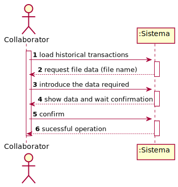

# UC5 - Regist Historical Transaction

## 1. Requirements Engineering

### Brief Format

The collaborator beggins loading the file with historical transactions. The system request for the necessary data about the file(i.e. file name). The collaborator introduces the data requiered. The system validate and show the data, waiting for confirmation. The collaborator confirms. The system load the file and records the transactions data and informs the collaborator about the success of the operation.

### SSD

### Complet Format

#### Main actor

Collaborator

#### Stakeholders and their interests
* Collaborator: pretends to load the historical transactions to see them.

#### Preconditions
* file must be created

#### Postconditions
* Platforma has already all the transactions that have been done.

#### Main success scenario (or basic flow)

1. The collaborator starts loading the file.
2. The system request for the necessary data (i.e. file name). 
3. The collaborator introduces the data requiered.
4. The system validate and show the data, waiting for confirmation.
5. The collaborator confirms. 
6. The system save the transactions history and notify the collaborator about the sucess of the operation.

#### Extensions (or alternative flows)

*a. The collaborator requests to cancel the creation.

> The use case ends.
	
4b. Missing minimum required data.
>	1. The system advice which data is missing.
>	2. The system allows the entry of missing data (step 2)
>
	>	2a. The collaborator doesn´t change the data. The use case ends.

4c. The system idenfitifies that the file name entered doesn´t correspond to a created file.
>	1. The system alerts collaborator about the fact.
>	2.The system allows its change (passo 2)
>
	>	2a. The collaborator doesn´t change the data. The use case ends.

#### Special requirements
n/a

#### List of Technologies and Data Variations
n/a

#### Frequency of Occurrence
n/a

#### Open questions

* How many files the collaborator can load?
* What is the requeired information in the file?

## 2. Análise OO

### Excerto do Modelo de Domínio Relevante para o UC

## 3. Design - Realização do Caso de Uso

### Racional

| Fluxo Principal | Questão: Que Classe... | Resposta  | Justificação  |
|:--------------  |:---------------------- |:----------|:---------------------------- |
|1. O utilizador não registado inicia o registo de uma organização.|... interage com o utilizador?| RegistarOrganizacaoUI |Pure Fabrication|
| |... coordena o UC?| RegistarOrganizacaoController |Controller|
| |... cria instâncias de Organizacao?|Plataforma|Creator(regra1)|
|2. O sistema solicita os dados necessários sobre a organização (i.e. nome da organização, o NIF, o endereço postal, um contacto telefónico, o endereço web, email) e sobre o colaborador (i.e. gestor) que está a proceder ao registo (i.e. nome, função, contacto telefónico, email e pwd).||||
|3. O utilizador não registado introduz os dados solicitados. |... guarda os dados introduzidos?|Organizacao, EnderecoPostal, Colaborador|IE: instância criada no passo 1|
| |... cria instâncias de EnderecoPostal?|Organizacao|creator(regra1)|
| |... cria instâncias de Colaborador?|Organizacao|creator(regra1)|
|4. O sistema valida e apresenta os dados, pedindo que os confirme. |... valida os dados da Organizacao (validação local)|Organizacao|IE: possui os seus próprios dados|
| |... valida os dados da Organizacao (validação local)|EnderecoPostal|IE: possui os seus próprios dados|
| |... valida os dados da Organizacao (validação local)|Colaborador|IE: possui os seus próprios dados|
| |... valida os dados da Organizacao (validação global)|Plataforma|IE: A Plataforma tem registadas Organizacao|
|5. O utilizador não registado confirma. ||||
|6. O sistema **regista os dados da organização e  do seu colaborador/gestor, tornando este último um utilizador registado** e informa o utilizador não registado do sucesso da operação.|... guarda a Organizacao criada?| Plataforma |IE: No MD a Plataforma tem  Organizacao|
| |... regista/guarda o Utilizador referente ao Colaborador da Organizacao?|AutorizacaoFacade|IE. A gestão de utilizadores é responsabilidade do componente externo respetivo cujo ponto de interação é através da classe "AutorizacaoFacade"|

             

### Sistematização ##

 Do racional resulta que as classes conceptuais promovidas a classes de software são:

 * Plataforma
 * Organizacao
 * Colaborador
 * EnderecoPostal

Outras classes de software (i.e. Pure Fabrication) identificadas:  

 * RegistarOrganizacaoUI  
 * RegistarOrganizacaoController

###	Diagrama de Sequência

###	Diagrama de Classes

