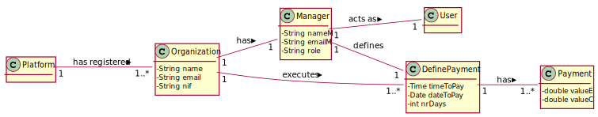
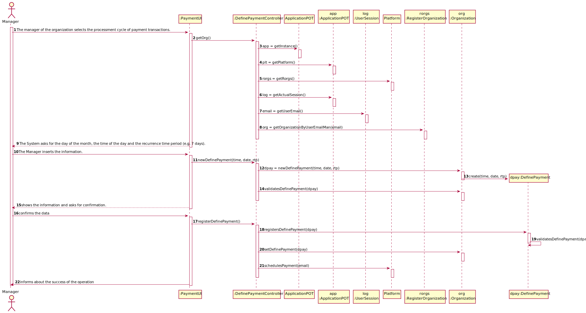
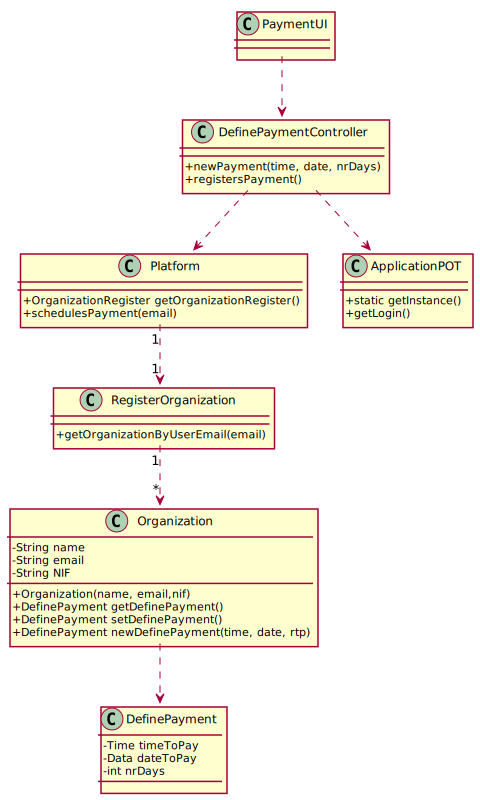

# UC6 - Define payments hour

## 1- Requirements engineering

The manager of the organization selects the processment cycle of payment transactions. The system asks for the day of the month, the time of the day and the recurring time. The manager inserts the information. The system requests the validation of the information. The manager confirms. The system regists the information.

### SSD

## Full Format

#### Main actor

Manager

#### Stakeholders and their interests

**Manager**: Wants the payments to be set to a specific day and time of the month.

#### Preconditions

* Each organization should have tasks/transactions registered in the system previously.

#### Postconditions

* A specific date and time is set to the payment of all tasks that have not been paid yet.

#### Main Success scenario

1. The manager of the organization selects the payment of transactions.
2. The system asks for the day of the month, the time of the day and the recurring time.
3. The manager inserts the information.
4. The system requests the validation of the information.
6. The manager confirms. The system regists the information.

#### Extensions

a. The Manager ends the process of defining a date and a time.
b. The system already has a time and date defined before

1a.
> 	1. The use case ends.

3b.
>	1. The system informs that there is a date and time already defined in the system for the payments.
>	2. The manager cancels. The use case ends.

#### Special requirements

N/A

--------------------

#### List of Technologies and Data Variations

N/A

--------------------

#### Frequency of Occurrence

N/A

--------------------

#### Open questions

* What if there is another date and time defined previously for the payment?

## 2. Object oriented analysis

### Relevant Domain Model for UC

## 3.Design - Use Case realization

| Basic flow| Question: What class.. | Answer  | Justification  |
|:--------------  |:---------------------- |:----------|:---------------------------- |
|1. The manager begins the processment cycle of payment transactions. |... Interacts with the user? | PaymentUI | Pure fabrication |
| |... coordinates the UC? | PaymentController | Controller |
| |...knows the user / manager using the system? | Login  | IE:documentation of the user management component. |
| |...which organization the user / manager belongs to? | OrganizationRegister | IE: Knows every Organization |
| |       | Organization | IE: Knows its Manager |
| |       | Manager | IE: Knows his own data (e.g. email) |
| |... creates instances of Payment | PaymentRegist | Creator(rule 1)
|2. The system asks for the day of the month, the time of the day and the recurring time. | 
|3. The manager inserts the information. |... stores the information entered? | PaymentRegist | 
|4. The system requests the validation of the information. |...validates the Date and time (local validation)?	 |    Payment         |  IE:has its own information.                            |
|5. The tasks that aren't payed will be payed on the date defined by the manager. | 
|6. The manager confirms. The system registers the information.

### Systematization

From the rational the conceptual classes promoted to software classes are:

* Manager
* Payment
* Transaction

Other software classes (i.e. Pure Fabrication) identified:

* PaymentUI
* DefinePaymentController
* PaymentList

Other classes of external systems / components:
 
* Login

### Sequence Diagram

### Class Diagram

