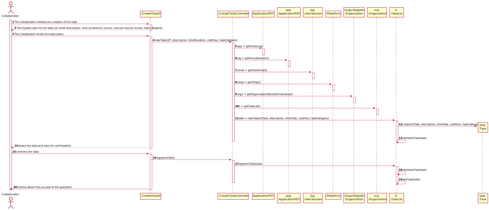

# UC 7 - Do Payment Automatically

## 1. Requirements Engineering

### Brief Format

### SSD

### Full Format

#### Main Actor

Collaborator

#### Stakeholders and their interests

* **Collaborator:** want to create tasks.
* **Organization:** want collaborator to create tasks.
* **T4J:** intends to pay freelancers.

#### Preconditions

The Organization has to be registered in the platform.

#### Post-conditions

The tasks are available in the platform.

#### Main success scenario (or basic flow)

1. The Collaborator initiates the creation of the task.
2. The System asks for the data (id, brief description, time duration(in hours), cost per hour(in euros), task category).
3. The Collaborator writes the data down. 
4. The System validates, shows the data and asks for confirmation.
5. The Collaborator confirms.
6. The System registers the data and informs about the success of the operation.

#### Extensions (or alternative flow)

*a. The Collaborator requests to cancel the creation of the task.

> The use case ends.

4a. Missing minimum required data.
>    1. The system informs you which data is missing.
>    2. The system allows the entry of missing data (step 3)
>
    >    2a. The Collaborator does not change the data. The use case ends.

4b. The System detects that the data (or some subset of the data) entered must be unique and that it already exists in the system.
>    1. The system alerts the collaborator to the fact.
>    2. The system allows its modification (step 3)
>
    >    2a.  The Collaborator does not change the data. The use case ends.

4c. The system detects that the data entered (or some subset of the data) is invalid.
> 1. The system alerts the collaborator to the fact.
> 2. The system allows its modification (step 3).
>
    > 2a.  The Collaborator does not change the data. The use case ends.

#### Special Requirements

#### List of Technologies and Data Variations

#### Frequency of Occurrence

#### Open questions

## 2. OO Analysis

### Excerpt from the Relevant Domain Model for UC

## 3. Design - Use Case Realization

### Rational

| Main Flow | Question: Which Class ... | Answer  | Justification  |
|:--------------  |:---------------------- |:----------|:---------------------------- |
| 1. The Collaborator initiates the creation of the task. 		 | ...interacts with the user?						 |   CreateTaskUI          |       Pure Fabrication:it is not justified to assign this responsibility to any existing class in the Domain Model           |
|       | ...coordinates the UC? | CreateTaskController | Controller |
|       | ...creates Task instance? | TaskList | Creator (Rule1) + HC/LC:in the MD the Organization has a Task. By HC / LC delegates these responsibilities in Task List |
|       | ...knows the user / manager using the system? | Login  | IE:documentation of the user management component. |
|       | ...which organization the user / collaborator belongs to? | OrganizationRegister | IE: Knows every Organization |
|       |       | Organization | IE: Knows its Collaborator |
|       |       | Collaborator | IE: Knows his own data (e.g. email) |
| 2. The System asks for the data (id, brief description, time duration(in hours), cost per hour(in euros), task category). | 							 |             |                              |
| 3. The Collaborator writes the data down. | ...stores the data entered?  | Task     | instance created in step 1: it has its own data.                              |
| 4. The System validates, shows the data and asks for confirmation.		 |	...validates the Task data (local validation)?	 |    Task         |  IE:has its own data.                            |
|       | ...validates the Task data (global validation)?       | TaskList | IE:the TaskList contains Task |
| 5. The Collaborator confirms.	 | 							 |             |                              |
| 6. The System registers the data and informs about the success of the operation.  |	...keeps the created Task?		 |  TaskList    | IE:the TaskList contains Task  |

### Systematization ##

 From the rational the classes that are upgraded into software classes are:

 * Organization
 * Platform
 * Task

 Other software classes (i.e. Pure Fabrication) identified:

 * CreateTaskUI
 * CreateTaskController
 * TaskList
 * OrganizationRegister
 
 Other classes of external systems / components:
 
 * Login

###	Sequence Diagram

###	Class Diagram

