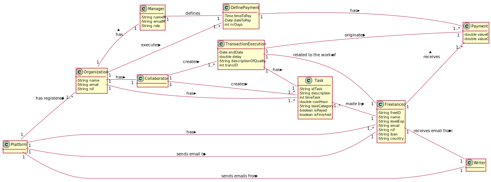

# UC 7 - Do Payment (Automatically)

## 1. Requirements Engineering

### Brief Format

The timer starts the automatic payment process time using the payment list, triggering the process at the defined date and time.

### SSD

### Full Format

#### Main Actor

Timer

#### Stakeholders and their interests

* **Organization:** intends to pay the freelancers.
* **Freelancer:** intends to receive the payment for the work made.

#### Preconditions

The date and the time must be present in the system so that the timer can start the process at that moment.

#### Post-conditions

The Freelancer receives the payment

#### Main success scenario (or basic flow)

1. The timer starts the automatic payment process.
2. The system makes payments using the payment list, triggering the process at the defined date and time, generating the receipt and sending an email to every freelancer.

#### Extensions (or alternative flow)

*2a. There is no date and time defined in the Payment.
> The use case ends.

2b. There is no payment in the Payment List to be made.
> The use case ends.

#### Special Requirements

#### List of Technologies and Data Variations

#### Frequency of Occurrence

Whenever time identifies that there is a payment to be made.

#### Open questions

## 2. OO Analysis

### Excerpt from the Relevant Domain Model for UC

## 3. Design - Use Case Realization

### Rational

| Main Flow | Question: Which Class ... | Answer  | Justification  |
|:--------------  |:---------------------- |:----------|:---------------------------- |
| 1. The timer starts the automatic payment process at the stipulated time.      | ...creates the instance of the Task?  | Platform | creator |
|       | ...coordinates the UC? | DoPaymentTask | Controller |
|       | ...knows the RegistOrganizations? | Platform | IE and HC+LC |
|       | ...has every Organization? | RegistOrganizations | HC+LC |
|       | ...knows the DefinePayment? | Organization | IE: each organization has a DefinePayment |
|       | ...creates the instance of the Timer? | Platform | creator | 
|       | ...determines that time has been reached? | Timer | IE |
| 2. The system makes payments using the payment list, triggering the process at the defined date and time, generating the receipt and sending an email to every freelancer. | ...knows the RegisterFreelancer? | Platform | IE and HC+LC |
|       | ...knows every Freelancer? | RegisterFreelancer | IE |
|       | ...knows the TaskList? | Organization | IE: Organization has tasks | 
|       | ...creates a temporary list to save the tasks for each freelancer? | DoPaymentTask | creator |
|       | ...has tasks? | TaskList | IE: task lists have tasks | 
|       | ...knows the RegisterTransaction | Platform | IE and HC+LC |
|       | ...knows every Transaction? | RegisterTransaction | IE and HC+LC |
|       | ...creates a temporary list to save the transactions for each freelancer? | DoPaymentTask | creator |
|       | ...creates Payment? | DoPayementTask | creator |
|       | ...knows the Writer? | DoPayementTask | IE |
|       | ...creates the Receipt? | Payment | creator |   

### Systematization ##

 From the rational the classes that are upgraded into software classes are:

 * Platform
 * Task
 * Transaction
 * Receipt
 * Writer
 * Organization
 * DefinePayment
 * Payment

 Other software classes (i.e. Pure Fabrication) identified:

 * DoPaymentTask 
 * TaskList
 * RegisterFreelancer
 * RegistOrganizations
 * RegisterTransaction
 
 Other classes of external systems / components:
 

###	Sequence Diagram

###	Class Diagram

* DoPaymentCD:

* generateReceiptCD:

