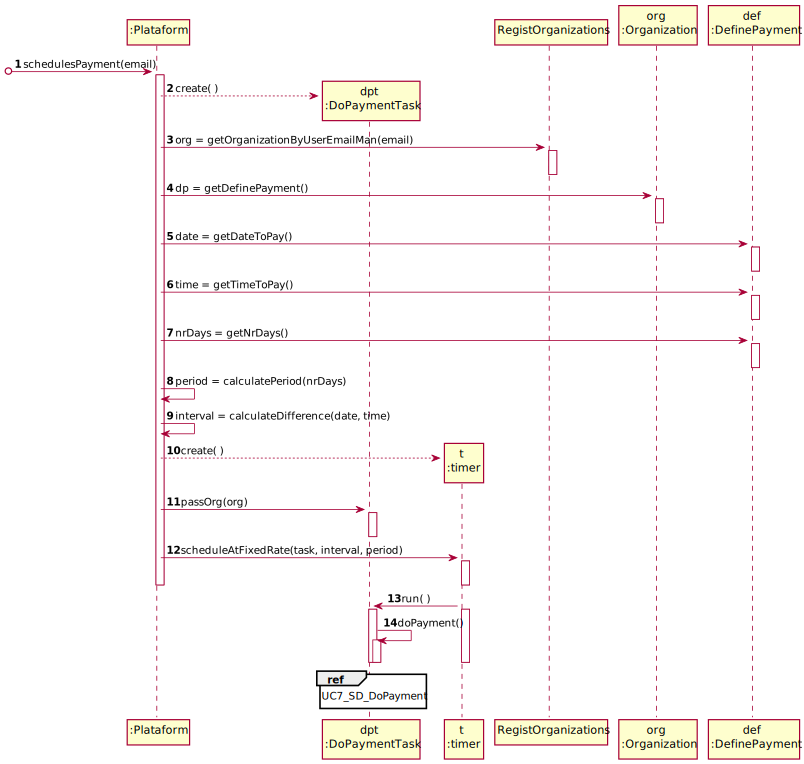
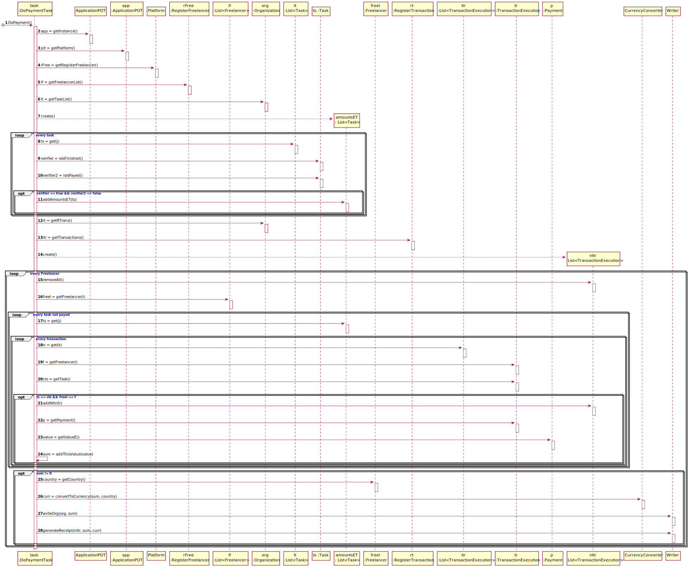

# UC 7 - Do Payment (Automatically)

## 1. Requirements Engineering

### Brief Format

The timer starts the automatic payment process time using the payment list, triggering the process at the defined date and time.

### SSD

### Full Format

#### Main Actor

Timer

#### Stakeholders and their interests

* **Organization:** intends to pay the freelancers.
* **Freelancer:** intends to receive the payment for the work made.

#### Preconditions

The date and the time must be present in the system so that the timer can start the process at that moment.

#### Post-conditions

The Freelancer receives the payment

#### Main success scenario (or basic flow)

1. The timer starts the automatic payment process.
2. The system makes payments using the payment list, triggering the process at the defined date and time.

#### Extensions (or alternative flow)

*2a. There is no date and time defined in the Payment.
> The use case ends.

2b. There is no payment in the Payment List to be made.
> The use case ends.

#### Special Requirements

#### List of Technologies and Data Variations

#### Frequency of Occurrence

Whenever time identifies that there is a payment to be made.

#### Open questions

How often is this process triggered?

## 2. OO Analysis

### Excerpt from the Relevant Domain Model for UC

## 3. Design - Use Case Realization

### Rational

| Main Flow | Question: Which Class ... | Answer  | Justification  |
|:--------------  |:---------------------- |:----------|:---------------------------- |
| 1. The timer starts the automatic payment process at the stipulated time.      | ...creates the instance of the task?  | Platform | creator |
|       | ...
|       | ...coordinates the UC? |
### Systematization ##

 From the rational the classes that are upgraded into software classes are:

 * Organization
 * Platform
 * Task

 Other software classes (i.e. Pure Fabrication) identified:

 * CreateTaskUI
 * CreateTaskController
 * TaskList
 * OrganizationRegister
 
 Other classes of external systems / components:
 
 * Login

###	Sequence Diagram

###	Class Diagram

