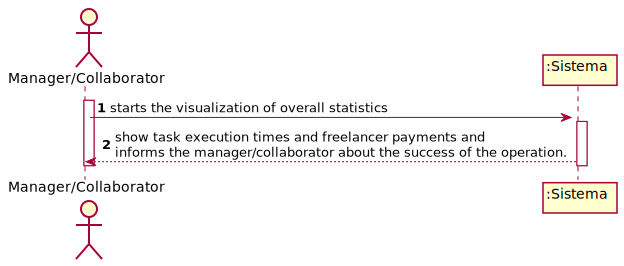

# UC8 - Check Overall Statistics

## 1. Requirements Engineering

### Brief Format

The collaborator/manager beggins watch overall statistics about task execution times and freelancer payments. The system show candidacy list and request the freelancer to choose one. The manager/collaborator choose the task. The system validate and show the data, waiting for confirmation. The manager/collaborator confirms. The system (por acabar) the and informs the manager/collaborator about the success of the operation.

### SSD

### Complet Format

#### Main actor

Manager/Collaborator

#### Stakeholders and their interests
* Collaborator: pretends to load the historical transactions to see them.

#### Preconditions
* file must be created

#### Postconditions
* Platforma has already all the transactions that have been done.

#### Main success scenario (or basic flow)

1. The collaborator starts loading the file.
2. The system request for the necessary data (i.e. file name). 
3. The collaborator introduces the data requiered.
4. The system validate and show the data, waiting for confirmation.
5. The collaborator confirms. 
6. The system save the transactions history and notify the collaborator about the sucess of the operation.

#### Extensions (or alternative flows)

*a. The collaborator requests to cancel the creation.

> The use case ends.
	
4b. Missing minimum required data.
>	1. The system advice which data is missing.
>	2. The system allows the entry of missing data (step 2)
>
	>	2a. The collaborator doesn´t change the data. The use case ends.

4c. The system idenfitifies that the file name entered doesn´t correspond to a created file.
>	1. The system alerts collaborator about the fact.
>	2.The system allows its change (passo 2)
>
	>	2a. The collaborator doesn´t change the data. The use case ends.

#### Special requirements
n/a

#### List of Technologies and Data Variations
n/a

#### Frequency of Occurrence
n/a

#### Open questions

* How many files the collaborator can load?
* What is the requeired information in the file?

## 2. OO Analysis

### Excerpt From The Relevant Domain Model For UC

## 3. Design - Use case realization

### Rational

| Main flow | Question: what class... | Answer | reason |
|:--------------  |:---------------------- |:----------|:---------------------------- |
|1. The collaborator starts uploading the file.|... interacts with the user?| HistoricalTransactionUI |Pure Fabrication|
| |... coordinates the UC?| HistoricalTransactionController |Controller|
| |... create instances of file?|Collaborator|Creator(rule1)|
|2. The system request the necessary data about the file (i.e. file name).||||
|3. The collaborator introducethe required data. |... saves the entered data?|Reader|IE: instance created in step 1|
|4. The system validates and show the data, asking confirmation. |... validate the data of Reader? (local validation)|Reader|IE: own your own data|
| |...validate the data of Reader? (global validation)|Platform|IE: Platform has historical transactions.|
|5. The collaborator confirms. ||||
|6. The system load all the information and notify the collaborator about the sucess of the operation.|... saves the reader created?| Platform |IE: No MD the platform has historical transactions|
             

### Sistematization ##

 From rational results that conceptual classes  conceptuais promoted to software classes are:

 * Platform
 * Collaborator
 * Reader

Other software classes (i.e. Pure Fabrication) identified:  

 * ReaderUI  
 * ReaderController

###	Sequence Diagram

###	Class Diagram

