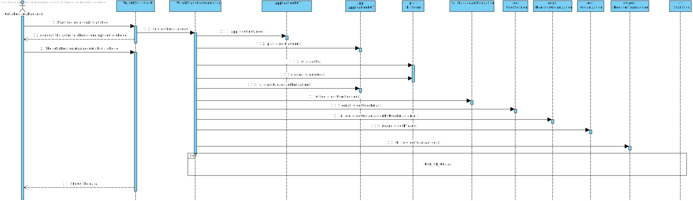
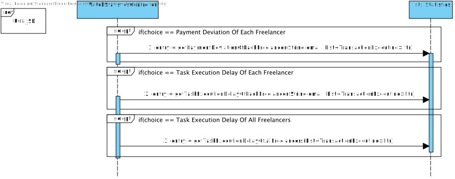
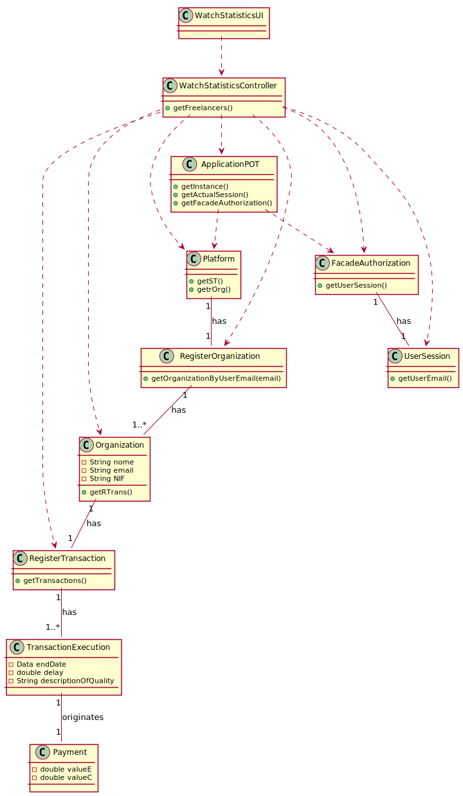

# UC8 - Check Overall Statistics

## 1. Requirements Engineering

### Brief Format

The collaborator/manager beggins watch overall statistics about task execution times and freelancer payments. The system show the statistics about task execution times and freelancer payments the and informs the manager/collaborator about the success of the operation.

### SSD

### Complet Format

#### Main actor

Manager/Collaborator

#### Stakeholders and their interests
* Collaborator: pretends to see overall statistics.
* Manager: pretends to see overall statistics.
* Freelancer: pretends to see their own statistics.

#### Preconditions

The system should have registered freelancers and transactions

#### Postconditions

* The system should show the Manager/Collaborator the performance of the freelancers of their organization.

#### Main success scenario (or basic flow)

1. The collaborator/manager beggins the watch overall statistics about task execution times and freelancer payments.
2. The system show the statistics about task execution times and freelancer payments the and informs the manager/collaborator about the success of the operation.

#### Extensions (or alternative flows)

*a. The collaborator requests to cancel the creation.

> The use case ends.
	
#### Special requirements
n/a

#### List of Technologies and Data Variations
n/a

#### Frequency of Occurrence
n/a

#### Open questions

## 2. OO Analysis

### Excerpt From The Relevant Domain Model For UC

## 3. Design - Use case realization

### Rational

| Main Flux | Question: Which class... | Answer  | Justification  |
|:--------------  |:---------------------- |:----------|:---------------------------- |
|1. The collaborator/manager starts watching overall statistics|...interacts with the user? | WatchStatisticsUI | Pure Fabrication|
|             |...coordinates the UC? | WatchStatisticsController | Controller |
|2. The collaborator/manager beggins watch overall statistics about task execution delay and freelancer payments. The system show the statistics about task execution times and freelancer payments the and informs the manager/collaborator about the success of the operation. |...knows the actual session | ApplicationPOT | IE: ApplicationPOT knows the registered users | 
| |...knows the Organization of the actual session user? | RegisterOrganization | HC+LC |
| |...knows RegisterOrganization? | Platform | IE: Platform has the list of Organizations |
| |...knows Platform? |	ApplicationPOT	| ApplicationPOT knows the platform |
| |...knows UserSession	| FacadeAuthorization | FacadeAuthorization knows the UserSession |
| |...knows FacadeAuthorization | ApplicationPOT | ApplicationPOT knows the FacadeAuthorization |
| |...knows the list of transactions? | RegisterTransaction | HC+LC |
| |...knows RegisterTransaction? | Organization | IE: Organization knows RegisterTransaction |
| |...knows the list of Freelancers? | RegisterFreelancer | HC+LC |
| |...knows RegisterFreelancer? | Platform | Platform knows all the freelancers | 
| |...knows the payment of each freelancer? | TransactionExecution | IE: In the MD, TransactionExecution originates a Payment |
| |...knows the delay of each freelancer? | TransactionExecution | IE: TransactionExecution knows its own data | 
             

### Sistematization ##

 From rational results that conceptual classes  conceptuais promoted to software classes are:

* Platform
* Organization
* TransactionExecution

Other software classes (i.e. Pure Fabrication) identified:  

 * WatchStatisticsUI  
 * WatchStatisticsController
 * RegisterTransactions
 * RegisterFreelancer

###	Sequence Diagram

###	Class Diagram

