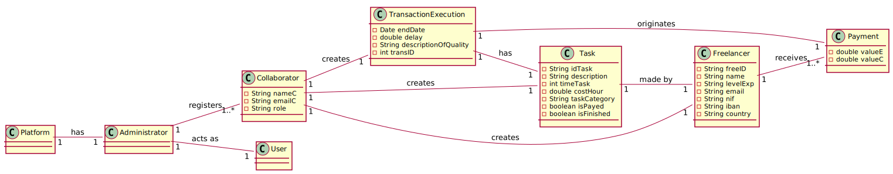
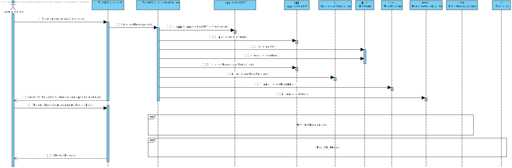
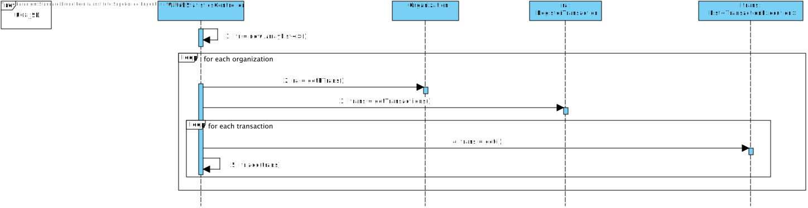
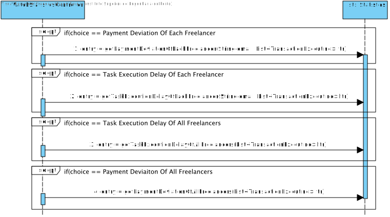

# UC 9 - Check Freelancer Performance

## 1.Requirement Engineering

### Brief format
The Administrator starts the visualization of the performance of the freelancers. The system shows the statistics describing the performance of the freelancers (the mean and the standard deviation of the delays and payments of all the freelancers and the histrograms that represent that) and shows the probability that the sample mean is higher than 3 hours.

### SSD

### Full Format

#### Main Actor

Administrator

#### Stakeholders and their interests
**Administrator**: intends to see the performance of the freelancers
**Freelancer**: intends to know if they performing accordingly to the necessary

#### Preconditions

n/a

#### Postconditions
* The system should show the Administrator the performance of all the freelancers.

#### Main success scenario 

1. The Administrator starts the visualization of the performance of the freelancers.
2. The system shows the statistics describing the performance of the freelancers (the mean and the standard deviation of the delays and payments of all the freelancers and the histrograms that represent that) and shows the probability that the sample mean is higher than 3 hours.

#### Extensions

*a. The Administrator ends the visualization of freelancer performances
> The use case ends.

#### Special requirements
\-

#### Lista of Data and Techonology variation
\-

#### Frequency of Occurence

\-

#### Open Questions

\-

## 2. Object oriented analysis

### Excerpt from the Relevant Domain Model for UC

## 3. Design - Realização do Caso de Uso

### Racional

| Main Flux | Question: Which class... | Answer  | Justification  |
|:--------------  |:---------------------- |:----------|:---------------------------- |
|1. The Administrator starts the visualization of the performance of the freelancers. |...interacts with the user? | CheckPerformanceUI | Pure Fabrication|
|             |...coordinates the UC? | CheckPerformanceController | Controller |
|2. The system shows the statistics describing the performance of the freelancers (the mean and the standard deviation of the delays and payments of all the freelancers and the histrograms that represent that) and shows the probability that the sample mean is higher than 3 hours. |...knows the list of transactions? | RegisterTransaction | HC+LC |
| |...knows RegisterTransaction? | Organization | IE: Organization knows RegisterTransaction |
| |...knows the list of Freelancers? | RegisterFreelancer | HC+LC |
| |...knows RegisterFreelancer? | Platform | Platform knows all the freelancers | 
| |...knows the payment of each freelancer? | TransactionExecution | IE: In the MD, TransactionExecution originates a payment |
| |...knows the delay of each freelancer? | TransactionExecution | IE: TransactionExecution knows its own data | 

### Sistematization ##

From the racional, the conceptual classes that are promoted to software classes are:

* Platform
* Organization
* TransactionExecution

Other software classes (eg: Pure Fabrication) identified:

 * CheckPerformanceUI
 * CheckPerformanceController
 * RegisterFreelancer
 * RegisterTransaction
 

### Sequence Diagram

### Class Diagram

